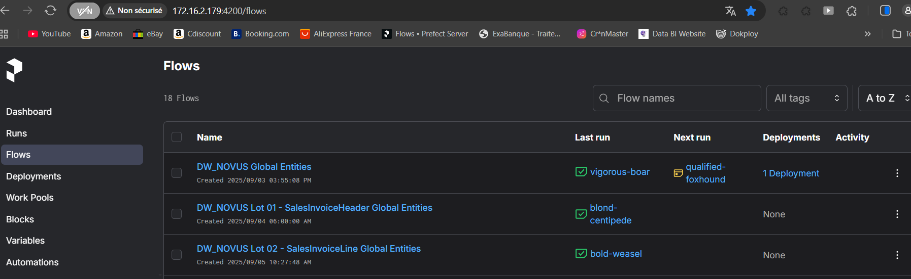

Pipeline ETL pour Business Central

### Architecture / Stack
- **Orchestration**: Prefect 3.0+
- **Langage**: Python 3.8+
- **Conteneurisation**: Docker, Docker Compose
- **Stockage**: Data Lake (format Parquet)
- **Bases de données**: SQL Server (BC et DWH)
- **Configuration**: Python dotenv, PyHocon
- **Versioning**: Git

### Travail technique détaillé
- Conception et implémentation d'une architecture ETL complète
- Développement de pipelines de données modulaires (5 lots distincts)
- Mise en place d'un data lake avec stockage intermédiaire en Parquet
- Création de tâches réutilisables pour l'extraction et le chargement
- Implémentation de mécanismes de troncation et rechargement
- Gestion des connexions et sécurisation des credentials

### Résultat / livrable
- Pipeline ETL robuste et modulaire
- Documentation détaillée du projet et des processus
- Scripts de test et de maintenance
- Structure de projet organisée et maintenable
- Système de logs détaillé pour le suivi des opérations

